# Physical Design using OpenLANE / SKY130
  This repository contains all the information studied and created during the [Advanced Physical Design Using OpenLANE / SKY130](https://www.vlsisystemdesign.com/advanced-physical-design-using-openlane-sky130/) workshop. It is primarily foucused on a complete RTL2GDS flow using the open-soucre flow named OpenLANE. [PICORV32A](https://github.com/cliffordwolf/picorv32) RISC-V core design is used for the purpose.

# Contents

- [Day 1 - Introduction to open-source EDA, OpenLANE and SKY130 PDK](#day-1---introduction-to-open-source-eda-openlane-and-sky130-pdk)
    1. [Basic IC Design Terminologies](#basic-ic-design-terminologies)
    2. [Introduction To RISC-V](#introduction-to-risc-v)
    3. [Introduction To RTL to GDSII Flow](#introduction-to-rtl-to-gdsii-flow)
    4. [List of Open Source Tools Used](#list-of-open-source-tools-used)
    5. [Google SkyWater130 PDK](#google-skywater130-pdk)
    6. [What is OpenLANE](#what-is-openlane)
    7. [Getting Started with OpenLANE](#getting-started-with-openlane)
        - [PDK Directory Structure](#pdk-directory-structure)
        - [OpenLANE Initialization](#openlane-initialization)
        - [Design Preparation](#design-preparation)
        - [Design Synthesis and Results](#design-synthesis-and-results)
 - [Day 2 - Good floorplan vs bad floorplan and introduction to library cells](#day-2---good-floorplan-vs-bad-floorplan-and-introduction-to-library-cells)
    - [Chip Floorplanning](#chip-floorplanning)
      - [Utilization Factor and Aspect Ratio](#utilization-factor-and-aspect-ratio)
      - [Power Planning](#power-planning)
      - [Pin Placement](#pin-placement)
      - [Floorplan using OpenLANE](#floorplan-using-openlane)
      - [Review Floorplan Layout in Magic](#review-floorplan-layout-in-magic)
    - [Placement](#placement)
      - [Placement and Optimization](#placement-and-optimization)
      - [Placement using OpenLANE](#placement-using-openlane)
    - [Cell Design and Characterization Flows](#cell-design-and-characterization-flows)
      - [Cell Design Flow](#cell-design-flow)
      - [Characterization Flow](#characterization-flow)
  - [Day 3 - Design library cell using Magic Layout and ngspice characterization](#day-3---design-library-cell-using-magic-layout-and-ngspice-characterization)
    - [Importing Custom Inverter Design ](#importing-custom-inverter-design)
    - [CMOS Inverter Design using Magic](#cmos-inverter-design-using-magic)
    - [Extract SPICE Netlist from Standard Cell Layout](#extract-spice-netlist-from-standard-cell-layout)
    - [Transient Analysis using NGSPICE](#transient-analysis-using-ngspice)
  - [Day 4 - Pre-layout timing analysis and importance of good clock tree](#day-4---pre-layout-timing-analysis-and-importance-of-good-clock-tree)
    - [Magic Layout to Standard Cell LEF](#magic-layout-to-standard-cell-lef)
      - [Importing custom LEF into synthesis flow](#importing-custom-lef-into-synthesis-flow)
    - [Timing Analysis using OpenSTA](#timing-analysis-using-opensta)
    - [Clock Tree Synthesis using TritonCTS](#clock-tree-synthesis-using-tritoncts)
  - [Day 5 - Final steps for RTL2GDS](#day-5---final-steps-for-rtl2gds)
    - [Generation of Power Distribution Network](#generation-of-power-distribution-network)
    - [Routing using TritonRoute](#routing-using-tritonroute)
    - [SPEF File Generation](#spef-file-generation)
  - [References](#references)
  - [Acknowledgement](#acknowledgement)
 

# Day 1 - Introduction to open-source EDA, OpenLANE and Sky130 PDK
 ## Basic IC Design Terminologies
  Some frequently used terminologies are mentioned below:
  - **Package**: It is a case that surrounds the circuit material to protect it from physical damage or corrosion and allow mounting of the electrical contacts connecting it to the printed circuit board (PCB). The below snippet shows an IC with 48 pins and Quad Flat No-Leads(QFN) package.
  - **Die**: A die is a small block of semiconducting material on which a given functional circuit is fabricated.
  - **Core**: It is the actual area of the IC where the logic resides.
  - **Pads**: These are the interfaces between the internal signals of a chip and the external pins


 ## Introduction To RISC-V
   RISC-V is a new ISA that's available under open, free and non-restrictive licences. RISC-V ISA delivers a new level of free, extensible software and hardware freedom on architecture.
   - It is far simpler and smaller than other commercial ISAs available.
   - It avoids micro-architecture or technology dependent features.
   - It has small standard base ISA and multiple standard extensions.
   - It supports variable-length instruction encoding.
   

## Introduction To RTL to GDSII Flow
  RTL to GDSII Flow refers to the all the steps involved in converting a logical Register Transfer Level(RTL) Design to a fabrication ready GDSII format. GDSII is a database file format which is an industry standard for data exchange of IC layout artwork.
  The RTL to GSDII flow consists of following steps:
  - RTL Synthesis
  - Static Timing Analysis(STA)
  - Design for Testability(DFT)
  - Floorplanning / Powerplanning
  - Placement
  - Clock Tree Synthesis(CTS)
  - Routing
  - GDSII Streaming
 
## List of Open Source Tools Used
  | Tool | Application |
  | --- | --- |
  | [Yosys](https://github.com/YosysHQ/yosys) | Synthesis of RTL Design |
  | ABC | Mapping of Netlist |
  | [OpenSTA](https://github.com/The-OpenROAD-Project/OpenSTA) | Static Timing Analysis |
  | [OpenROAD](https://github.com/The-OpenROAD-Project/OpenROAD) | Floorplanning, Placement, CTS, Optimization, Routing |
  | [TritonRoute](https://github.com/The-OpenROAD-Project/TritonRoute) | Detailed Routing |
  | [Magic VLSI](http://opencircuitdesign.com/magic/) | Layout Tool |
  | [NGSPICE](https://github.com/imr/ngspice) | SPICE Extraction and Simulation |
  | SPEF_EXTRACTOR | Generation of SPEF file from DEF file |
  
 ## Google SkyWater130 PDK
  Google and SkyWater Technology Foundry in collaboration have released a completely open-source Process Design Kit(PDK) in May, 2020. The current release target to a SKY130 (i.e. 130 nm) process node is available as [SkyWater Open Source PDK](https://github.com/google/skywater-pdk). The PDK provides Physical VLSI Designer with a wide range of flexibility in design choices. All the designs and simulations listed in this repository are carried out using the same SkyWater Open Source PDK.
  
 ## What is OpenLANE
   [OpenLANE](https://github.com/efabless/openlane) is an automated RTL to GDSII flow which includes various open-source components such as OpenROAD, Yosys, Magic, Fault, Netgen, SPEF-Extractor. It also facilitates to add custom design exploration and optimization scripts.
   The detailed diagram of the OpenLANE architecture is shown below:
   

   
   OpenLANE flow consists of several stages. By default all flow steps are run in sequence. Each stage may consist of multiple sub-stages. OpenLANE can also be run interactively as shown here.

  1. Synthesis
      1. `yosys` - Performs RTL synthesis
      2. `abc` - Performs technology mapping
      3. `OpenSTA` - Pefroms static timing analysis on the resulting netlist to generate timing reports
  2. Floorplan and PDN
      1. `init_fp` - Defines the core area for the macro as well as the rows (used for placement) and the tracks (used for routing)
      2. `ioplacer` - Places the macro input and output ports
      3. `pdn` - Generates the power distribution network
      4. `tapcell` - Inserts welltap and decap cells in the floorplan
  3. Placement
      1. `RePLace` - Performs global placement
      2. `Resizer` - Performs optional optimizations on the design
      3. `OpenPhySyn` - Performs timing optimizations on the design
      4. `OpenDP` - Perfroms detailed placement to legalize the globally placed components
  4. CTS
      1. `TritonCTS` - Synthesizes the clock distribution network (the clock tree)
  5. Routing *
      1. `FastRoute` - Performs global routing to generate a guide file for the detailed router
      2. `TritonRoute` - Performs detailed routing
      3. `SPEF-Extractor` - Performs SPEF extraction
  6. GDSII Generation
      1. `Magic` - Streams out the final GDSII layout file from the routed def
  7. Checks
      1. `Magic` - Performs DRC Checks & Antenna Checks
      2. `Netgen` - Performs LVS Checks
      
 ## Getting Started with OpenLANE
 ### PDK Directory Structure
   All the Process Design Kit(PDK) are listed under the `pdks/` directory. Along with the `Sky130A` we are using some other open-source PDKs and other related files are also available in the directory. The location of the PDK directory is given of `$PDK_ROOT` variable. 
    
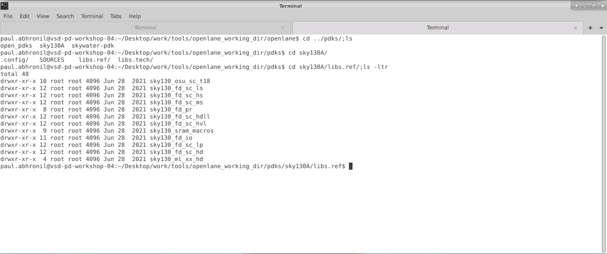
 
 ### OpenLANE Initialization
   For invoking OpenLANE in Linux Ubuntu, we navigate to `/Desktop/work/tools/openlane_working_dir/openlane` and  first run the docker everytime we use OpenLANE. This is done by using the following script:
    
    docker
   
   A custom shell script or commands can be generated to make the task simpler.
   
   - To invoke OpenLANE run the `./flow.tcl` script.
   - OpenLANE supports two modes of operation: interactive and autonomous.
   - To use interactive mode use `-interactive` flag with `./flow.tcl`
   

   
 ### Design Preparation
   The first step after invoking OpenLANE is to import the openlane package of required version. This is done using following command. Here 0.9 is the required version of OpenLANE.
   
    package require openlane 0.9
    
   The next step is to prepare our design for the OpenLANE flow. This is done using following command:
       
    prep -design <design-name>
      
   During the design preparation the technology LEF and cell LEF files are merged together to obtain a `merged.lef` file. The LEF file contains information like the layer information, set of design rules, information about each standard cell which is required for place and route. 
    
 ### Design Synthesis and Results
   The first step in OpenLANE flow is RTL Synthesis of the design loaded. This is done using the following command.
   
    run_synthesis
   
   
# Day 2 - Good floorplan vs bad floorplan and introduction to library cells
 ## Chip Floorplanning
   Chip Floorplanning is the arrangement of logical block, library cells, pins on silicon chip. It makes sure that every module has been assigned an appropriate area and aspect ratio, every pin of the module has connection with other modules or periphery of the chip and modules are arranged in a way such that it consumes lesser area on a chip.
   
 ### Utilization Factor and Aspect Ratio
   Utilization Factor is ratio of the area of core used by standard cells to the total core area. The utilization factor is generally kept in the range of 0.5-0.7 i.e. 50% - 70%. Maintaining a proper utilization factor facilitates placement and routing optimization.
   
 ### Power Planning
   Power planning is a step in which power grid network is created to distribute power to each part of the design equally. This step deals with the unwanted voltage drop and ground bounce. Steady state IR Drop is caused by the resistance of the metal wires comprising the power distribution network. By reducing the voltage difference between local power and ground, steady-state IR Drop reduces both the speed and noise immunity of the local cells and macros.
   
 ### Pin Placement
   Pin placement is a important part of floorplanning as the timing delays and number of buffers required is dependent on the position of the pin. There are multiple pin placement option available such as equidistant placement, high-density placement.
 
 ### Floorplan using OpenLANE
   Floorplanning in OpenLANE is done using the following command. 
    
    run_floorplan
   
   Successful floorplanning gives a `def` file as output. This file contains the die area and placement of standard cells.
   
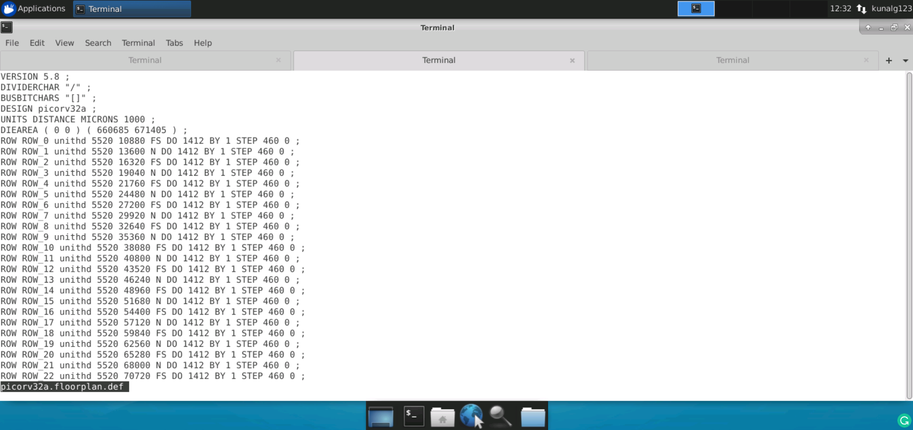
 
 ### Review Floorplan Layout in Magic
   Magic Layout Tool is used for visualizing the layout after floorplan. In order to view floorplan in Magic, following three files are required:
    1. Technology File (`sky130A.tech`)
    2. Merged LEF file (`merged.lef`)
    3. DEF File
    
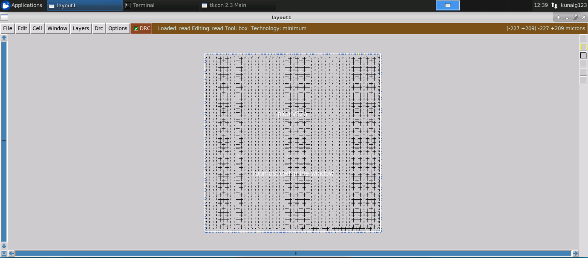
 
 ## Placement
 ### Placement and Optimization
   The next step after floorplanning is placement. Placement determines location of each of the components on the die. Placement does not just place the standard cells available in the synthesized netlist. It also optimizes the design, thereby removing any timing violations created due to the relative placement on die.
   
 ### Placement using OpenLANE
   Placement in OpenLANE is done using the following command. 
    
    run_placement
   
   The DEF file created during floorplan is used as an input to placement. Placement in OpenLANE occurs in two stages:
   - Global Placement
   - Detailed Placement

   
 ## Cell Design and Characterization Flows
 ### Cell Design Flow
  In a border view Cell Design flow is are the stages or steps involved in the entire design of a standard cell. The figure below shows the input, output and design steps involved in cell design
  
  
 
 ### Characterization Flow
  There are few problems of Standard Cells in polygon level format (GDSII). Some of them are:
  - Extraction of functionality is complicated and unnecessary as it is known
  - Functional/Delay simulation takes way too long
  - Power extraction for a whole chip takes too long
  - Automatic detection of timing constraints (e.g. Setup time) is difficult

  A solution to above problems is Cell Characterization. It is a simple model for delay, function, constraints and power on cell/gate level. The Characterization Flow consists of the following stages:
  1. Netlist Extraction - Transistors, resistances and capacitances are extracted with special tools and saved as SPICE netlist (or similar)
  2. Specification of parameters - Library-wide parameters have to be specified: e.g. max Transition time
  3. Model selection and specification - The used models determine the required data
  4. Measurement - The cells are simulated with a SPICE-like tool to obtain the required data
  5. Model Generation - The obtained data is fed into the models
  6. Verification - Different checks are performed to ensure the correctness of the characterization
 
# Day 3 - Design library cell using Magic Layout and ngspice characterization
  Every Design is represented by equivalent cell design. All the standard cell designs are available in the Cell Library. A fully custom cell design that meets all rules can be added to the library. To begin with, a CMOS Inverter is designed in Magic Layout Tool and analysis is carried out using NGSPICE tool.

SPICE Deck - It is a connectivity information about a cell. It is a netlist. It has the inputs, tap points, etc.

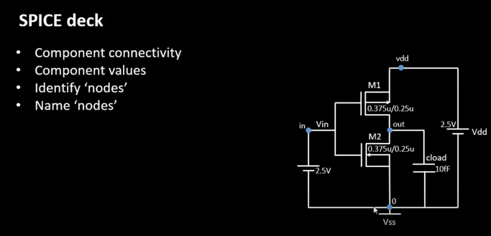  

The SPICE Deck is written below:
```
*** MODEL Description ***
*** NETLIST Description ***
M1 out in vdd vdd pmos W=o.375 L=0.25 *** [component name] [connectivity] [drain] [gate] [source] [substrate] [type] [dimensions W/L] ***
*** Similarly for NMOS ***
M2 out in vdd vdd nmos W=o.375 L=0.25
*** load cap connecivity and value [name] [node1] [node2] [value] ***
cload out 0 10f
*** Supply voltage [name] [node1] [node2] [value] ***
Vdd vdd 0 2.5
*** Input voltage [name] [node1] [node2] [value] ***
Vin in 0 2.5
*** Simulation Command ***
.op
.dc Vin 0 2.5 0.05 *** Sweeping gate input form 0 to 2.5 at steeps of 0.05  VTC curve***
*** describe the model file ***
.LIB "tsmc_025ummodel.mod" CMOS_MODELS
.end
```

 ## Importing Custom Inverter Design
The following repo is cloned into the directory
```
git clone https://github.com/nickson-jose/vsdstdcelldesign.git
```
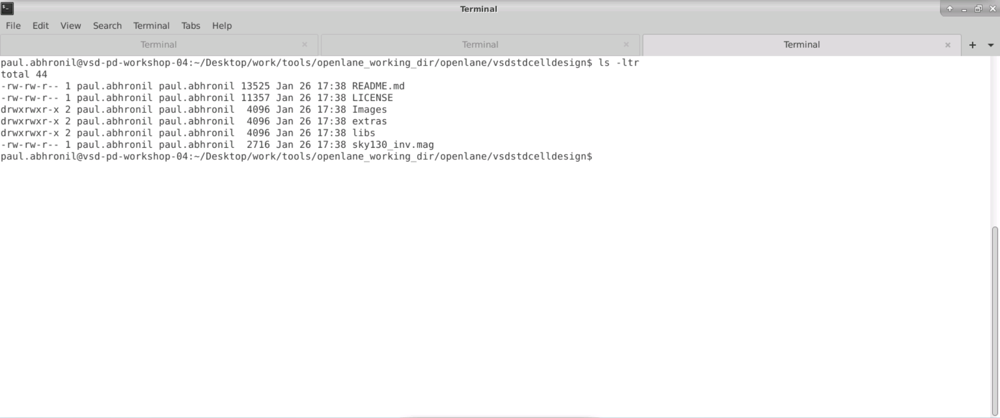
  
 ## CMOS Inverter Design using Magic
  The inverter design is done using Magic Layout Tool. It takes the technology file as an input (`sky130A.tech` in this case). Magic tool provide a very easy to use interface to design various layers of the layout. It also has an in-built DRC check fetaure.
  The snippet below shows a layout for CMOS Inverter with and without design rule violations.
  
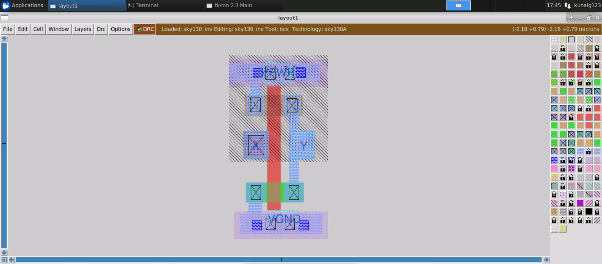
  
 ## Extract SPICE Netlist from Standard Cell Layout
  To simulate and verify the functionality of the standard cell layout designed, there is a need of SPICE netlist of a given layout. To mention in brief, "Simulation Program with Integrated Circuit Emphasis (SPICE)" is an industry standard design language for electronic circuitry. SPICE model very closely models the actual circuit behavior.
  Extraction of SPICE model for a given layout is done in two stages.
  1. Extract the circuit from the layout design.
  
    extract all
  
  2. Convert the extracted circuit to SPICE model.
    
    ext2spice cthresh 0 rthresh 0
    ext2spice
  
  The extracted SPICE model like the first snippet shown below. Some modification are done to the SPICE netlist for the purpose of simulations, which is shown in the second snippet below.
  
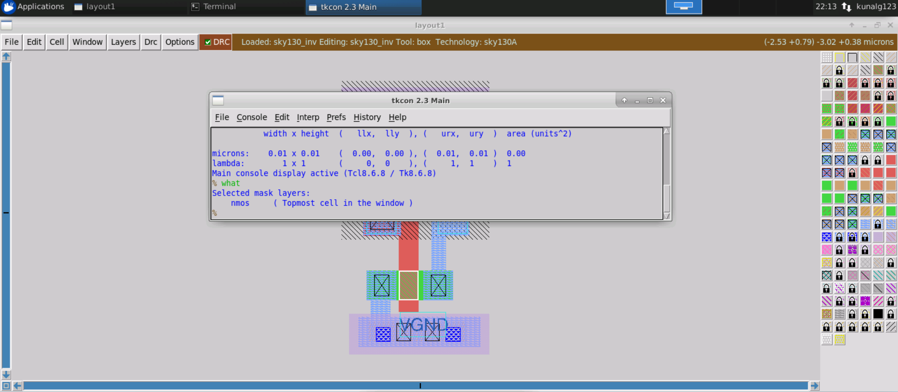
  
 ## Transient Analysis using NGSPICE
  The SPICE netlist generated in previous step is simulated using the NGSPICE tool. NGSPICE is an open-source mixed-level/mixed-signal electronic spice circuit simulator.
  
  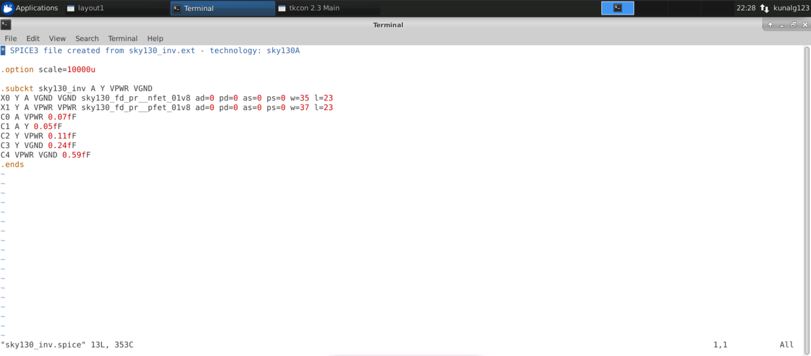
  
  The command used to invoke NGSPICE is shown below.
  
    ngspice <name-of-SPICE-netlist-file>
    
  Following command is used to plot waveform in ngspice tool.
    
    ngspice 1 -> plot Y vs time A
    

   
   Below figure shows the waveform of Inverter output vs input w.r.t. time. Many timing parameters like rise time delay, fall time delay, propagation delay are calculated using this waveform.
   
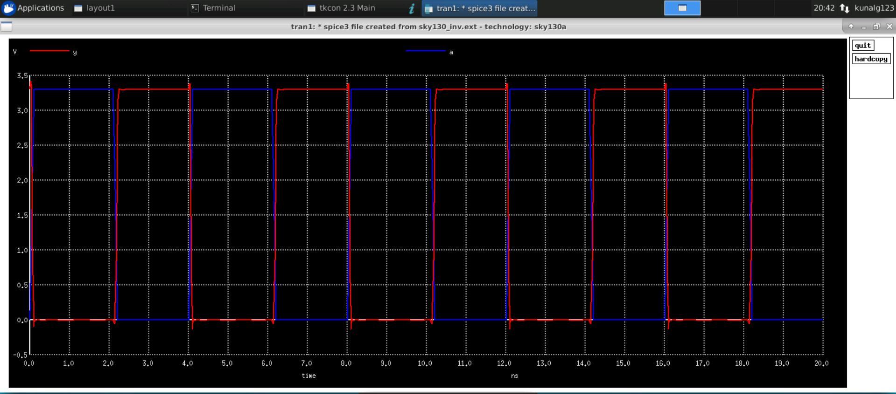
  
# Day 4 - Pre-layout timing analysis and importance of good clock tree
  In order to use a design of standard cell layout in OpenLANE RTL2GDS flow, it is converted to a standard cell LEF. LEF stands for Library Exchange Format. The entire design has to be analyzed for any timing violations after addition or change in the design.
  
 ## Magic Layout to Standard Cell LEF
  Before creating the LEF file we require some details about the layers in the designs. This details are available in a `tracks.info` as shown below. It gives information about the `offset` and `pitch` of a track in a given layer both in horizontal and vertical direction. The track information is given in below mentioned format. Additionally LEF file helps to protect the IP since no cnnectivity information is disclosed.

For each technology, tracks information is provided by the foundary and they are necessary because routes for each layer can only go over their respective tracks.
  
    <layer-name> <X-or-Y> <track-offset> <track-pitch>
    
  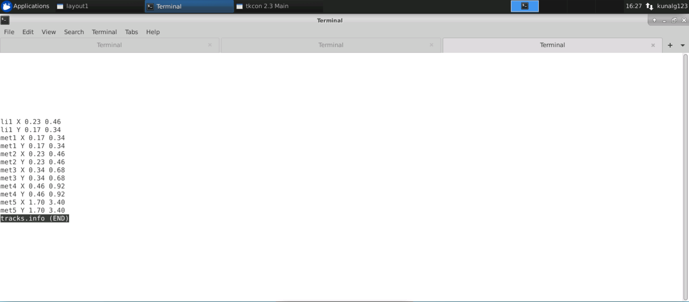
  
  To create a standard cell LEF from an existing layout, some important aspects need to be taken into consideration.
  1. The height of cell be appropriate, so that the `VPWR` and `VGND` properly fall on the power distribution network.
  2. The width of cell should be an odd multiple of the minimum permissible grid size.
  3. The input and ouptut of the cell fall on intersection of the vertical and horizontal grid line.
  
  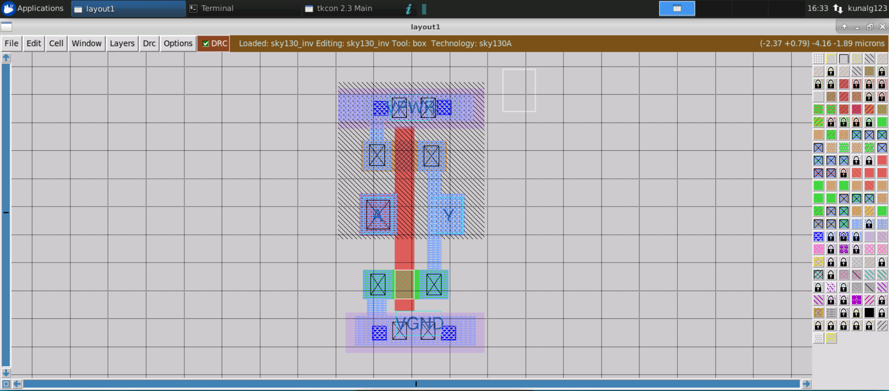
  
  ### Importing Custom LEF into synthesis flow
  In order to use this cell in our OpenLANE flow, we need to add the related libs and LEF in our flow and we need to update the onfiguration file for our design so that our custom LEF and libs are read in the OpenLANE flow.
  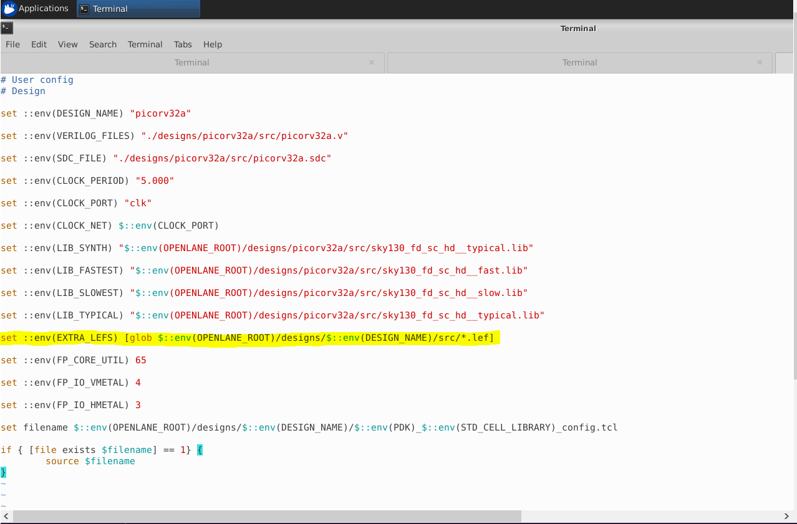
  
    
    ./flow.tcl -interactive
    package require openlane 0.9
    prep -design <design_name> -tag <runs_folder> -overwrite
    set lefs [glob $::env(DESIGN_DIR)/src/*.lef]
    add_lefs -src $lefs
    run_synthesis
    
  We can notice the new custom inverter cells in the synthesis summary,
  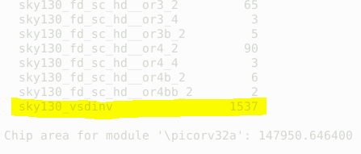
  
  The `run_floorplan` command fails in the new version of OpenLANE, hence we use the following flow:
 
    init_floorplan
    place_io
    gloabl_placement_or
    detailed_placement
    tap_decap_or
    detailed_placement
    gen_pdn
 
 
 ## Timing Analysis using OpenSTA
  The Static Timing Analysis(STA) of the design is carried out using the OpenSTA tool. The analysis can be done in to different ways.
  - Inside OpenLANE flow: This is by invoking `openroad` command inside the OpenLANE flow. In the openroad OpenSTA is invoked.
  - Outside OpenLANE flow: This is done by directly invoking OpenSTA in the command line. This requires extra configuration to be done to specific the verilog file, constraints, clcok period and other required parameters.
  
  For running STA using OpenSTA, we first need to create a SDC `my_base.sdc` with same values as used in our synthesis runs and create a configuration file `pre_sta.conf`. Now sta can be performed using sta `pre_sta.conf` .

```   
## my_base.sdc


set ::env(CLOCK_PORT) clk
set ::env(CLOCK_PERIOD) 24.73
set ::env(SYNTH_DRIVING_CELL) sky130_fd_sc_hd__inv_8
set ::env(SYNTH_DRIVING_CELL_PIN) Y
set ::env(SYNTH_CAP_LOAD) 17.65
create_clock [get_ports $::env(CLOCK_PORT)]  -name $::env(CLOCK_PORT)  -period $::env(CLOCK_PERIOD)
set IO_PCT  0.2
set input_delay_value [expr $::env(CLOCK_PERIOD) * $IO_PCT]
set output_delay_value [expr $::env(CLOCK_PERIOD) * $IO_PCT]
puts "\[INFO\]: Setting output delay to: $output_delay_value"
puts "\[INFO\]: Setting input delay to: $input_delay_value"


set clk_indx [lsearch [all_inputs] [get_port $::env(CLOCK_PORT)]]
#set rst_indx [lsearch [all_inputs] [get_port resetn]]
set all_inputs_wo_clk [lreplace [all_inputs] $clk_indx $clk_indx]
#set all_inputs_wo_clk_rst [lreplace $all_inputs_wo_clk $rst_indx $rst_indx]
set all_inputs_wo_clk_rst $all_inputs_wo_clk


# correct resetn
set_input_delay $input_delay_value  -clock [get_clocks $::env(CLOCK_PORT)] $all_inputs_wo_clk_rst
#set_input_delay 0.0 -clock [get_clocks $::env(CLOCK_PORT)] {resetn}
set_output_delay $output_delay_value  -clock [get_clocks $::env(CLOCK_PORT)] [all_outputs]

# TODO set this as parameter
set_driving_cell -lib_cell $::env(SYNTH_DRIVING_CELL) -pin $::env(SYNTH_DRIVING_CELL_PIN) [all_inputs]
set cap_load [expr $::env(SYNTH_CAP_LOAD) / 1000.0]
puts "\[INFO\]: Setting load to: $cap_load"
set_load  $cap_load [all_outputs]
```

```
## pre_sta.conf

set_cmd_units -time ns -capacitance pF -current mA -voltage V -resistance kOhm -distance um
read_liberty -min /home/paul.abhronil/Desktop/work/tools/openlane_working_dir/openlane/designs/picorv32a/src/sky130_fd_sc_hd__fast.lib
read_liberty -max /home/paul.abhronil/Desktop/work/tools/openlane_working_dir/openlane/designs/picorv32a/src/sky130_fd_sc_hd__slow.lib
read_verilog /home/paul.abhronil/Desktop/work/tools/openlane_working_dir/openlane/designs/picorv32a/runs/25-01_13-56/results/synthesis/picorv32a.synthesis.v
link_design picorv32a
read_sdc /home/paul.abhronil/Desktop/work/tools/openlane_working_dir/openlane/designs/picorv32a/src/my_base.sdc
report_checks -path_delay min_max -fields {slew trans net cap input_pin}
report_tns
report_wns

```
 
    sta <pre_sta.conf>
   
    
  The above command gives an Timing Analysis Report which contains:
   1. Total Negative Slack = `-711.23`
   2. Worst Negative Slack = `-23.89`
    
  If the design produces any setup timing violaions in the analysis, it can be eliminated or reduced using techniques as follows:
  1. Increase the clock period (Not always possible as generally operating frequency is freezed in the specifications)
  2. Scaling the buffers (Causes increase in design area)
  3. Restricting the maximum fan-out of an element. 
  
  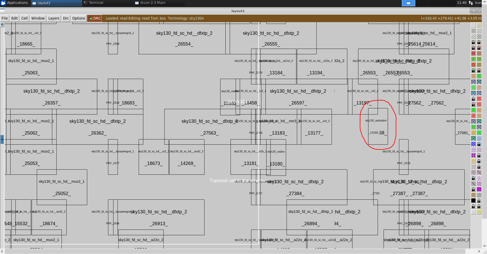
  
 ## Clock Tree Synthesis using TritonCTS
  Clock Tree Synthesis(CTS) is a process which makes sure that the clock gets distributed evenly to all sequential elements in a design. The goal of CTS is to minimize the clock latency and skew.
  There are several CTS techniques like:
  1. H - Tree
  2. X - Tree
  3. Fish bone
  
  In OpenLANE, clock tree synthesis is carried out using TritonCTS tool. CTS should always be done after the floorplanning and placement as the CTS is carried out on a `placement.def` file that is created during placement stage.
  
  ```
  ## placemnt.def
## **CTS tree in TritonCTS is built considering single corner at a time (typical by default). Hence may see timing violations at slow/fast corners.**

openroad
read_lef /openLANE_flow/designs/picorv32a/runs/07-08_06-58/tmp/merged.lef
read_def /openLANE_flow/designs/picorv32a/runs/07-08_06-58/results/cts/picorv32a.cts.def
write_db picorv32a_cts.db
read_db picorv32a_cts.db

read_verilog /openLANE_flow/designs/picorv32a/runs/07-08_06-58/results/synthesis/picorv32a.synthesis_cts.v
read_liberty $::env(LIB_SYNTH_COMPLETE)
### read_liberty -min $::env(LIB_FASTEST)
### read_liberty -max $::env(LIB_SLOWEST)

link_design picorv32a

read_sdc /openLANE_flow/designs/picorv32a/src/my_base.sdc

set_propagated_clock [all_clocks]

report_checks -path_delay min_max -fields {slew trans net cap input_pin} -format full_clock_expanded >> /openLANE_flow/designs/picorv32a/runs/07-08_06-58/reports/cts/cts_timing.openroad.typical.rpt
```

  
  The command used for running CTS in OpenLANE is given below.
  
    run_cts
    


# Day 5 - Final steps for RTL2GDS
 ## Generation of Power Distribution Network
   In a normal RTL to GDSII flow the generation of power distribution network is done before the placement step, but in the OpenLANE flow generation of PDN is carried out after the Clock Tree Synthesis(CTS). This step generates all the tracks, rails required for routing power to entire chip.
   Generation of power distribution network is done using following command.
   
    gen_pdn
    

   
 ## Routing using TritonRoute
   OpenLANE uses TritonRoute, an open source router for modern industrial designs. The router consists of several main building blocks, including pin access analysis, track assignment, initial detailed routing, search and repair, and a DRC engine.
   The routing process is implemented in two stages:
   1. Global Routing - Routing guides are generated for interconnects
   2. Detailed Routing - Tracks are generated interatively.
   TritonRoute 14 ensures there are no DRC violations after routing.
   
   The following command is used for routing.
   
    run_routing
    

    
 ## SPEF File Generation
   Standard Parasitic Exchange Format (SPEF) is an IEEE standard for representing parasitic data of wires in a chip in ASCII format. Non-ideal wires have parasitic resistance and capacitance that are captured by SPEF. 
   OpenLANE consists of a tool named, SPEF_EXTRACTOR for generation of SPEF file. It is a `python` based parser which takes the `LEF` and `DEF` files as input arguments and generates the SPEF file. The following command is used for invoking the SPEC_EXTRACTOR.
   
    cd <path-to-SPEF_EXTRACTOR-tool-directory>
    python3 main.py <path-to-LEF-file> <path-to-DEF-file-created-after-routing>
    
   
# References
  - RISC-V: https://riscv.org/
  - VLSI System Design: https://www.vlsisystemdesign.com/
  - OpenLANE: https://github.com/The-OpenROAD-Project/OpenLane
  - Magic VLSI: http://opencircuitdesign.com/magic/index.html

# Acknowledgement
  - [Kunal Ghosh](https://github.com/kunalg123), Co-founder, VSD Corp. Pvt. Ltd.
  - [Nickson Jose](https://github.com/nickson-jose)
